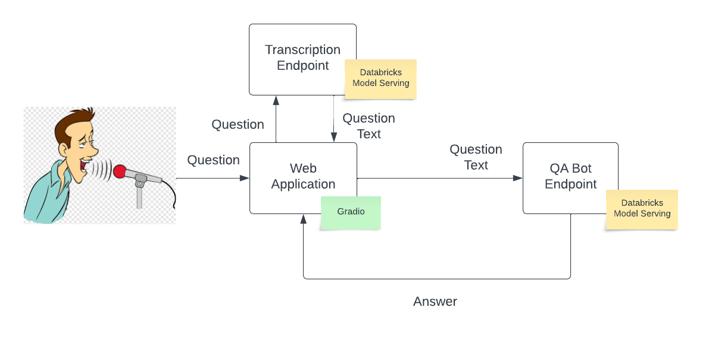

# Speech enabled QA chatbot
A Q&A chatbot with ability to recognise speech and answer questions from Documents



## Follow the below steps to setup machine to deploy the App

1. TODO: Download the policy documents to dbfs.
1. You need the latest databricks-cli to using Asset bundle. please un-install existing databricks and follow the [link](https://docs.databricks.com/en/dev-tools/cli/databricks-cli-ref.html#language-Homebrew%C2%A0installation%C2%A0on%C2%A0macOS%C2%A0or%C2%A0Linux)
    ```
    brew tap databricks/tap
    brew install databricks
    ```
1. Setup a profile using databricks CLI. you will need workspace url and token refer [here]( https://docs.databricks.com/en/dev-tools/cli/databricks-cli-ref.html#databricks-personal-access-token-authentication) on how to set it up
    ```
    databricks configure --host <workspace-url> --profile <some-unique-configuration-profile-name>
    ```
2. Create a .env file in the frontend/app folder and add the following parameters:
   You can create a token in *User settings* withing the Databricks workspace your model is served in.
    ```
    DATABRICKS_TOKEN=<your-databricks-token>
    DATABRICKS_URL=<your_databricks_url>
    TRANSCRIPTION_MODEL_NAME=<your-transcription-model-name>
    ```
3. Install the following using brew (on MacOS) or alternative on other operating systems:
    ```
    brew install ffmpeg
    ```
4. Install python requirements:
    ```
    pip install -r requirements.txt
    ```
4. Add your workspace url to asset bundle file (bundle.yml):
    ```
    environments:
      production:
      workspace:
        host:  <your-workspace-url>
    ```
5. Optional : To use LLAMA-2 models, you need to agree to the terms and condition of HuggingFace and provide an API key to download the models
Refer to these steps to download the key : https://huggingface.co/docs/api-inference/quicktour#get-your-api-token and set the below parameters in the backend/util/notebook-config.py
    ```
    43 if "Llama-2" in config['model_id']:
    44      config['HUGGING_FACE_HUB_TOKEN'] = '< your HF key>'
    ```
6. Optional : To use Azure form-recognizer you need to update the below parameters in the backend/util/notebook-config.py.
    ```
    54    if config['use_azure_formrecognizer'] == True:
    55      config['formendpoint'] = 'xxxxxx'
    56      config['formkey'] = 'xxxxxxx'
    ```
## Cluster Configurations
The Code to run open LLMS has been tested on the below single node cluster configurations:
- AWS : g5-12xlarge [4 A10's]
- Azure : NC24Ads_A100_v4 [1 A100]

## Create and Launch the Job to create the Vector Database
    ```
    make profile=<your profile name> launch-vectore-store-job
    ```

## Create and Launch the Job to load the whisper model
    ```
    make profile=<your profile name> deploy-whisper
    ```
If the job throws the following error, there's a good chance that it is deployed successfully regardless of the error message. Navigate to the *models* tab to confirm your model is registered. Here's the expected error:

```
MlflowException: Exceeded max wait time for model name: whisper-cmt version: 1 to become READY. Status: PENDING_REGISTRATION Wait Time: 300
```

In the databricks UI, navigate to the *serving* tab and create an endpoint with single GPU and a size small using the whisper model you registered (in the Workspace models search for whisper).

## Steps to the run the UI
- **Make sure by vector store is setup before trying to run the App**. </br>
To run the App first launch the job to setup the llm model serving.
    ```
    make profile=<your profile name> launch-llm-job
    ```

- Once the Job is running check if the flask app is running properly and then launch the UI </br>
    ```
    make profile=<your profile name> launch-ui
    ```